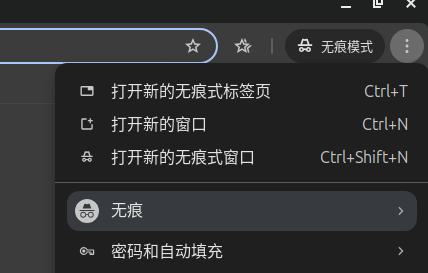

# 网络安全——隐私安全

隐私是一个个人或团体隔离自己或有关自己不愿告诉别人或不愿公开的信息或事务，从而得以选择性地表达自己的能力。[1](https://zh.wikipedia.org/zh-hans/%E9%9A%90%E7%A7%81)下面将介绍一些简单的隐私保护技巧。

## 隐私浏览

### 概述

众多 Chromium 内核（如 Chrome、Edge 等）与 Firefox 内核的浏览器有隐私浏览的功能。在隐私模式下，浏览器不会使用 Cookies，不会保存浏览记录，可以简单地防止能够接触到这个计算机的用户获取你的隐私。

### 用法

#### Chrome 用户（包括 Edge 等 Chromium 内核浏览器，操作逻辑类似）

单击这里的`打开新的无痕式窗口`即可。其他 Chromium 内核浏览器操作逻辑类似

#### Firefox 用户

单击这里的`新建隐私窗口`即可。

### 缺点

虽然可以获得更加私密的浏览体验，但是这种方式并不能对互联网服务提供商（Internet Service Provider，ISP，在国内就是我们熟悉的三大运营商或者你的校园网的提供方）隐藏你的信息，并不是真正意义上的匿名。

## VPN

VPN，全称**虚拟专用网络**，是指将专用网络延伸至互联网上的一种技术。许多企业用户需要自己搭建 VPN 以实现机密文件的传递，当然，普通人也能使用到这一技术。

## 图片资源

[Chrome 隐私模式](./resources/img1.png)、[Firefox 隐私模式](./resources/img2.png) 图像来源 [GitHub@Coconut-Aero](https://github.com/Coconut-Aero)
