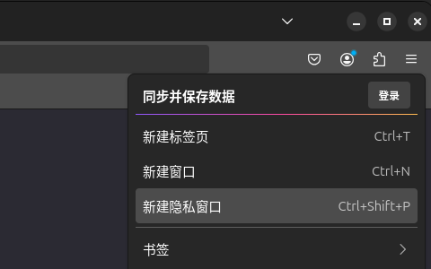
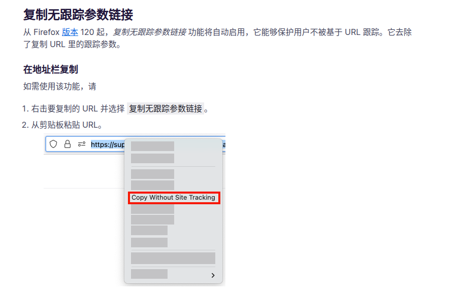
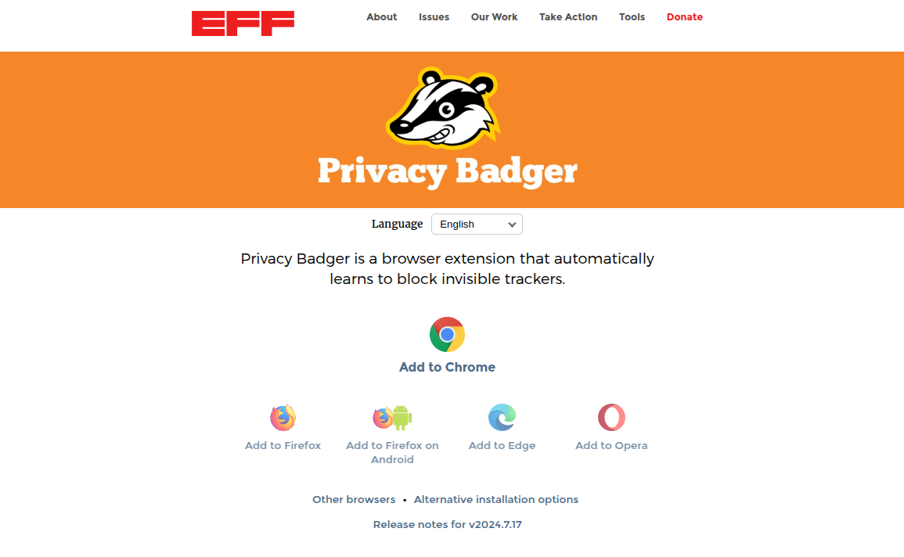
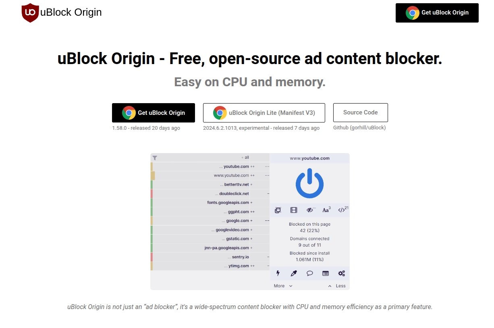

# 网络安全——隐私安全

隐私是一个个人或团体隔离自己或有关自己不愿告诉别人或不愿公开的信息或事务，从而得以选择性地表达自己的能力。[1](https://zh.wikipedia.org/zh-hans/%E9%9A%90%E7%A7%81)下面将介绍一些简单的隐私保护技巧。

## 隐私浏览

### 概述

众多 Chromium 内核（如 Chrome、Edge 等）与 Firefox 内核的浏览器有隐私浏览的功能。在隐私模式下，浏览器不会使用 Cookies，不会保存浏览记录，可以简单地防止能够接触到这个计算机的用户获取你的隐私。

### 用法

#### Chrome 用户（包括 Edge 等 Chromium 内核浏览器，操作逻辑类似）

单击这里的`打开新的无痕式窗口`即可。其他 Chromium 内核浏览器操作逻辑类似

#### Firefox 用户

单击这里的`新建隐私窗口`即可。

### 缺点

虽然可以获得更加私密的浏览体验，但是这种方式并不能对互联网服务提供商（Internet Service Provider，ISP，在国内就是我们熟悉的三大运营商或者你的校园网的提供方）隐藏你的信息，并不是真正意义上的匿名。

### VPN

VPN，全称**虚拟专用网络**，是指将专用网络延伸至互联网上的一种技术。许多企业用户需要自己搭建 VPN 以实现机密文件的传递，当然，普通人也能使用到这一技术。

## 隐私意识

### 无追踪参数

网站为了这样那样的目的，经常在链接中插入一些难以理解的参数从而导致用户被追踪。通常，网站不一定是为了破坏用户的隐私，但是这仍然可能导致用户的隐私泄漏

#### 解决方案

1. 手动删除追踪参数

例如，从Bilibili复制的网址：[https://www.bilibili.com/video/BVXXXXXX?vd_source=XXXXXXXX](https://www.bilibili.com/video/BVXXXXXX?vd_source=XXXXXXXX), 尝试删除 `?vd_source=XXXXXXXX` 类似的内容。

2. 使用Firefox的`复制无追踪参数链接`

可参考 [Firefox 桌面版的增强跟踪保护 | Firefox 帮助](https://support.mozilla.org/zh-CN/kb/Firefox%20%E6%A1%8C%E9%9D%A2%E7%89%88%E7%9A%84%E5%A2%9E%E5%BC%BA%E8%B7%9F%E8%B8%AA%E4%BF%9D%E6%8A%A4) 中的提示：

### Do Not Track

Do Not Track 是一项HTTP头字段，当用户启用这一功能时，浏览器会在HTTP请求中加上字段`dnt:1`，表示用户不希望被追踪。然而，是否响应这一字段取决于网站，同时社区和法律缺乏对于是否相应DNT请求的监管，导致其效果非常有限。

## 浏览器的隐私插件

下面将列举一些好用的浏览器隐私插件，它们通过限制广告商的个性化广告保护用户的隐私。

### Privacy Badger

隐私獾是适用于Chrome和Firefox的隐私扩展，旨在对于不遵守DNT协议的广告进行阻止。

### AdBlock

AdBlock是一款比较好用的广告拦截插件。AdBlock分为`AdBlock`和`AdBlock Plus`两种。对于`AdBlock`还有免费版本和Premium的区别。不过，免费版本依然能够使用大部分功能。

### uBlock

uBlock同样是一款比较好用的广告拦截插件，uBlock前期为独立项目，后被`AdBlock`开发商收购。现在的`uBlock Origin`是原来项目的延续。uBlock只需要很小的内存和CPU占用便能高效地移除广告，因而受到用户的欢迎。

然而，也许是触犯到大企业的利益，近期，Chrome宣布uBlock`未遵循 Chrome 扩展程序的最佳实践`，不过仍然可以安装，也可以使用替代品`uBlock Origin Lite`。

## 图片资源

[Chrome 隐私模式](./resources/img1.png)、[Firefox 隐私模式](./resources/img2.png) 图像来源 [GitHub@Coconut-Aero](https://github.com/Coconut-Aero)

[Firefox复制无追踪参数链接](./resources/img3.png) 图像来源[Firefox 桌面版的增强跟踪保护|Firefox 帮助](https://support.mozilla.org/zh-CN/kb/Firefox%20%E6%A1%8C%E9%9D%A2%E7%89%88%E7%9A%84%E5%A2%9E%E5%BC%BA%E8%B7%9F%E8%B8%AA%E4%BF%9D%E6%8A%A4)

[Privacy Badger](./resources/img5.png) 图像来源 [Privacy Badger](https://privacybadger.org/)

[AdBlock](./resources/img6.png) 图像来源 [AdBlock—浏览网页时再也不用担心恼人的广告和弹窗了！](https://getadblock.com/zh_CN/)

[uBlock](./resources/img7.png) 图像来源 [uBlock Origin - Free, open-source ad content blocker.](https://ublockorigin.com/)

[uBlock 未遵循 Chrome 扩展程序的最佳实践](./resources/img8.png) 图像来源 [uBlock Origin - Chrome应用商店](https://chrome.google.com/webstore/detail/ublock-origin/cjpalhdlnbpafiamejdnhcphjbkeiagm)

## 开发者笔记

有关于对于Do Not Track的有效性的评价，你可以访问[这个链接](https://gizmodo.com/do-not-track-the-privacy-tool-used-by-millions-of-peop-1828868324)