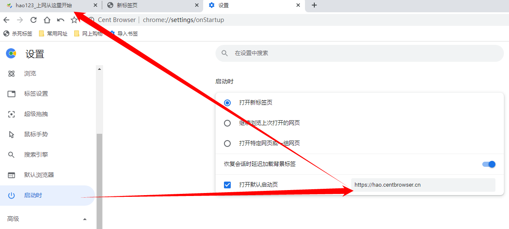

# 浏览器选择与配置指南

## 为什么浏览器选择至关重要

浏览器是现代数字生活的门户，一个优秀的浏览器应具备以下核心特性：

| 特性 | 说明 | 重要性 |
|------|------|--------|
| **性能效率** | 快速页面加载，低资源占用 | ⭐⭐⭐⭐⭐ |
| **兼容性** | 完美支持现代Web标准 | ⭐⭐⭐⭐ |
| **扩展性** | 支持功能丰富的插件系统 | ⭐⭐⭐⭐ |
| **隐私保护** | 内置反追踪和安全功能 | ⭐⭐⭐⭐ |
| **纯净体验** | 无广告干扰和捆绑功能 | ⭐⭐⭐⭐ |

**强烈建议卸载**以下类型的浏览器：
- 任何名称包含"安全"、"极速"、"双核"的国产浏览器
- 带有数字公司前缀的浏览器（如360、2345等）
- 会强制修改主页或默认搜索引擎的浏览器

## 主流浏览器推荐与对比

### 1. Microsoft Edge (基于Chromium)

- **推荐指数**: ★★★★★
- **核心优势**:
  - 预装于Win10/Win11系统，开箱即用
  - 内存优化优秀（睡眠标签页功能）
  - 内置PDF阅读器和屏幕截图工具
  - 垂直标签页和集锦功能提升效率
- **适用人群**: Windows用户、多设备同步需求者
- [官方下载](https://www.microsoft.com/zh-cn/edge)

### 2. Google Chrome
- **推荐指数**: ★★★★☆
- **核心优势**:
  - 最完整的Web标准支持
  - 最大的扩展库（Chrome Web Store）
  - 开发者工具功能最强大
- **注意事项**:
  - 需科学上网才能使用完整功能（同步、扩展商店）
  - 内存占用较高
- **适用人群**: 开发者、谷歌生态用户
- [官方下载](https://www.google.com/chrome/)

### 3. Mozilla Firefox
- **推荐指数**: ★★★★☆
- **核心优势**:
  - 开源且注重隐私（增强跟踪保护）
  - 独立渲染引擎（Gecko），避免Chromium垄断
  - 高度可定制界面
- **重要警告**:
  - ❌ 避免国内定制版（firefox.com.cn）
  - ✅ 仅使用国际版（mozilla.org）
- **开发者版本**: [Firefox Developer Edition](https://www.mozilla.org/zh-CN/firefox/developer/)
- **适用人群**: 隐私关注者、Linux用户
- [官方下载](https://www.mozilla.org/zh-CN/firefox/new/)

### 4. 百分浏览器 (Cent Browser)
- **推荐指数**: ★★★☆☆
- **核心优势**:
  - 内置鼠标手势和超级拖拽
  - 滚动标签栏和多功能地址栏
  - 适合国内网络环境
- **注意事项**:
  - 更新频率较低
  - 部分安全特性不及官方Chromium
- **适用人群**: 从国产浏览器迁移的用户
- [官方下载](https://www.centbrowser.cn/)

### 5. Min Browser
- **推荐指数**: ★★☆☆☆
- **核心优势**:
  - 极简设计（仅4MB大小）
  - 开源透明（GitHub托管）
  - 内置广告拦截和阅读模式
- **适用场景**:
  - 老旧设备
  - 临时浏览需求
- **局限**: 功能简单，不支持扩展
- [官方下载](https://minbrowser.org/)

### 浏览器特性对比表

| 特性                | Edge | Chrome | Firefox | 百分浏览器 | Min |
|---------------------|------|--------|---------|------------|-----|
| 内存优化            | ✅    | ❌      | ⚠️      | ⚠️         | ✅  |
| 扩展支持            | ✅    | ✅      | ✅       | ✅         | ❌  |
| 隐私保护            | ✅    | ⚠️      | ✅       | ⚠️         | ✅  |
| 国内无需代理        | ✅    | ❌      | ✅       | ✅         | ✅  |
| 开发者工具          | ✅    | ✅      | ✅       | ✅         | ❌  |
| 内置实用工具        | ✅    | ❌      | ❌       | ✅         | ⚠️  |

## 浏览器配置优化指南

### 1. 搜索引擎设置

- **推荐配置**:
  - 国际用户: DuckDuckGo + Google
  - 国内用户: Bing + 百度
- **设置路径**: 
  `设置 > 隐私、搜索和服务 > 地址栏和搜索`

### 2. 下载管理
- **关键设置**:
  - 更改默认下载位置（避免C盘爆满）
  - 开启"下载前询问每个文件的保存位置"
  - 设置下载完成后的通知
- **路径**: 
  `设置 > 下载`

> **文件路径最佳实践**
> - 使用全英文路径（避免中文乱码问题）
> - 示例: `D:\Downloads\` 而非 `D:\下载\`
> - 重要文件定期备份到云存储

### 3. 启动与新标签页配置

- **新标签页**:
  - 推荐: 空白页或自定义仪表盘（如Tabliss）
  - 避免: 新闻聚合页面（影响加载速度）
  
- **主页设置**:
  
  - 实用配置: 
    ```markdown
    about:blank           # 空白页
    https://startpage.com # 隐私搜索引擎
    chrome://bookmarks    # 书签页
    ```

### 4. 隐私与安全强化
- **必开选项**:
  - 增强跟踪防护（Edge/Firefox）
  - 请勿跟踪信号发送
  - 安全DNS（推荐Cloudflare 1.1.1.1）
  
- **高级防护**:
  ```markdown
  [*.] 禁用第三方Cookie
  [*.] 定期清除浏览数据
  [*.] 使用隐私模式处理敏感操作
  ```

### 5. 性能优化设置
- **内存管理**:
  - 启用睡眠标签页（Edge）
  - 限制后台运行
  - 硬件加速（根据GPU性能调整）

- **实验室功能**:
  - Edge效率模式
  - Chrome内存节省程序

## 进阶技巧

### 多浏览器协作方案
1. **开发调试**：Chrome(主)+Firefox(兼容性测试)
2. **隐私浏览**：Firefox+Tor Browser
3. **日常使用**：Edge+垂直标签页管理

### 书签同步方案
| 方案          | 优点                  | 缺点          |
|---------------|----------------------|---------------|
| 浏览器自带同步 | 无缝集成             | 平台限制      |
| Raindrop.io   | 跨浏览器支持         | 高级功能付费  |
| Floccus       | 开源/WebDAV支持      | 配置复杂      |

### 便携版浏览器
- **场景**: 公共电脑/U盘随身携带
- **推荐**:
  - [PortableApps平台](https://portableapps.com/)
  - [Firefox Portable](https://portableapps.com/apps/internet/firefox_portable)

## 参考资料与扩展阅读
1. [Edge官方技巧库](https://microsoftedgetips.microsoft.com/zh-cn/)
2. [Firefox隐私保护指南](https://support.mozilla.org/zh-CN/kb/enhanced-tracking-protection-firefox-desktop)
3. [浏览器基准测试](https://browserbench.org/)
4. [开源浏览器列表](https://opensource.com/article/19/7/open-source-browsers)

> **终极建议**: 定期更新浏览器至最新版本，这是保持安全性和兼容性的关键。建议开启自动更新功能，确保始终获得最新的安全补丁和功能改进。